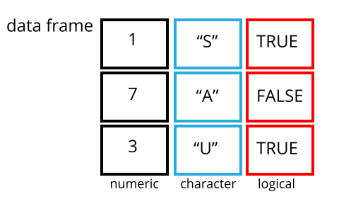

```{r, echo=FALSE, purl=FALSE, message = FALSE}
source("setup.R")
```


# Starting with Data

------------

> ### Learning Objectives
>
> * Describe what a data frame is.
> * Load external data from a .csv file into a data frame.
> * Summarize the contents of a data frame.
> * Format dates.

------------


## Presentation of the Survey Data

```{r, echo=FALSE, purl=TRUE}
### Presentation of the survey data
```

We are studying the species repartition and weight of animals caught in plots in our study
area. The dataset is stored as a comma separated value (CSV) file.
Each row holds information for a single animal, and the columns represent:

| Column           | Description                        |
|------------------|------------------------------------|
| record\_id       | Unique id for the observation      |
| month            | month of observation               |
| day              | day of observation                 |
| year             | year of observation                |
| plot\_id         | ID of a particular plot            |
| species\_id      | 2-letter code                      |
| sex              | sex of animal ("M", "F")           |
| hindfoot\_length | length of the hindfoot in mm       |
| weight           | weight of the animal in grams      |
| genus            | genus of animal                    |
| species          | species of animal                  |
| taxon             | e.g. Rodent, Reptile, Bird, Rabbit |
| plot\_type       | type of plot                       |

We are going to use the R function `download.file()` to download the CSV file
that contains the survey data from figshare, and we will use `read_csv()` to
load into memory the content of the CSV file as an object of class `data.frame`. 
Inside the download.file command, the first entry is a character string with the source URL 
("https://ndownloader.figshare.com/files/2292169"). This source URL downloads a CSV file from 
figshare. The text after the comma ("data/portal_data_joined.csv") is the destination of the 
file on your local machine. You'll need to have a folder on your machine called "data" where 
you'll download the file. So this command downloads a file from figshare, names it 
"portal_data_joined.csv," and adds it to a preexisting folder named "data."

```{r, eval=FALSE, purl=TRUE}
library(tidyverse)

download.file(url="https://ndownloader.figshare.com/files/2292169",
              destfile = "data/portal_data_joined.csv"))
```

You are now ready to load the data:

```{r, eval=TRUE,  purl=FALSE}
surveys <- read_csv("data/portal_data_joined.csv")
```

This statement doesn't produce any output because, as you might recall,
assignments don't display anything. If we want to check that our data has been
loaded, we can see the contents of the data frame by typing its name: `surveys`.

Wow... that was a lot of output. At least it means the data loaded
properly. Let's check the top (the first 6 lines) of this data frame using the
function `head()`:

```{r, results='show', purl=FALSE}
head(surveys)
## Try also
## View(surveys)
```

## What are data frames?

Data frames are the _de facto_ data structure for most tabular data, and what we
use for statistics and plotting.

A data frame can be created by hand, but most commonly they are generated by the
functions `read_csv()` or `read.table()`; in other words, when importing
spreadsheets from your hard drive (or the web).

A data frame is the representation of data in the format of a table where the
columns are vectors that all have the same length. Because columns are
vectors, each column must contain a single type of data (e.g., characters, integers,
factors). For example, here is a figure depicting a data frame comprising a
numeric, a character, and a logical vector.




We can see this when inspecting the <b>str</b>ucture of a data frame
with the function `str()`:

```{r, purl=FALSE}
str(surveys)
```

## Inspecting `data.frame` Objects

We already saw how the functions `head()` and `str()` can be useful to check the
content and the structure of a data frame. Here is a non-exhaustive list of
functions to get a sense of the content/structure of the data. Let's try them out!

* Size:
    * `dim(surveys)` - returns a vector with the number of rows in the first element,
          and the number of columns as the second element (the **dim**ensions of
          the object)
    * `nrow(surveys)` - returns the number of rows
    * `ncol(surveys)` - returns the number of columns

* Content:
    * `head(surveys)` - shows the first 6 rows
    * `tail(surveys)` - shows the last 6 rows

* Names:
    * `names(surveys)` - returns the column names (synonym of `colnames()` for `data.frame`
	   objects)
    * `rownames(surveys)` - returns the row names

* Summary:
    * `str(surveys)` - structure of the object and information about the class, length and
	   content of  each column
    * `summary(surveys)` - summary statistics for each column

Note: most of these functions are "generic", they can be used on other types of
objects besides `data.frame`.


> ### Challenge
>
> Based on the output of `str(surveys)`, can you answer the following questions?
>
> * What is the class of the object `surveys`?
> * How many rows and how many columns are in this object?
> * How many species have been recorded during these surveys?
>
> ```{r, answer=TRUE, results="markup", purl=FALSE}
>
> str(surveys)
>
> ## * class: data frame
> ## * how many rows: 34786,  how many columns: 13
> ## * how many species: 48
>
> ```


```{r, echo=FALSE, purl=TRUE}

## Challenge
## Based on the output of `str(surveys)`, can you answer the following questions?
## * What is the class of the object `surveys`?
## * How many rows and how many columns are in this object?
## * How many species have been recorded during these surveys?

```


## Indexing and subsetting data frames

```{r, echo=FALSE, purl=TRUE}

## Indexing and subsetting data frames
```


Our survey data frame has rows and columns (it has 2 dimensions), if we want to
extract some specific data from it, we need to specify the "coordinates" we
want from it. Row numbers come first, followed by column numbers. However, note
that different ways of specifying these coordinates lead to results with
different classes.


```{r, purl=FALSE}
# first element in the first column of the data frame (as a vector)
surveys[1, 1]   
# first element in the 6th column (as a vector)
surveys[1, 6]   
# first column of the data frame (as a vector)
surveys[, 1]    
# first column of the data frame (as a data.frame)
surveys[1]      
# first three elements in the 7th column (as a vector)
surveys[1:3, 7] 
# the 3rd row of the data frame (as a data.frame)
surveys[3, ]    
# equivalent to head_surveys <- head(surveys)
head_surveys <- surveys[1:6, ] 
```

`:` is a special function that creates numeric vectors of integers in increasing
or decreasing order, test `1:10` and `10:1` for instance.

You can also exclude certain indices of a data frame using the "`-`" sign:

```{r, purl=FALSE}
surveys[, -1]          # The whole data frame, except the first column
surveys[-c(7:34786), ] # Equivalent to head(surveys)
```

Data frames can be subset by calling indices (as shown previously), but also by calling their column names directly:

```{r, eval = FALSE, purl=FALSE}
surveys["species_id"]       # Result is a data.frame
surveys[, "species_id"]     # Result is a vector
surveys[["species_id"]]     # Result is a vector
surveys$species_id          # Result is a vector
```

In RStudio, you can use the autocompletion feature to get the full and correct names of the columns.

## Formatting Dates

This next section is taken from Chapter 16 of Hadley Wickham and Garrett Grolemund's book [R for Data Science](https://r4ds.had.co.nz/dates-and-times.html) which is licensed under the [Creative Commons Attribution-NonCommercial-NoDerivs 3.0](https://creativecommons.org/licenses/by-nc-nd/3.0/us/) license.

### Introduction

This chapter will show you how to work with dates and times in R. At first glance, dates and times seem simple. You use them all the time in your regular life, and they don’t seem to cause much confusion. However, the more you learn about dates and times, the more complicated they seem to get. To warm up, try these three seemingly simple questions:

Does every year have 365 days?
Does every day have 24 hours?
Does every minute have 60 seconds?
I’m sure you know that not every year has 365 days, but do you know the full rule for determining if a year is a leap year? (It has three parts.) You might have remembered that many parts of the world use daylight savings time (DST), so that some days have 23 hours, and others have 25. You might not have known that some minutes have 61 seconds because every now and then leap seconds are added because the Earth’s rotation is gradually slowing down.

Dates and times are hard because they have to reconcile two physical phenomena (the rotation of the Earth and its orbit around the sun) with a whole raft of geopolitical phenomena including months, time zones, and DST. This chapter won’t teach you every last detail about dates and times, but it will give you a solid grounding of practical skills that will help you with common data analysis challenges.

### Prerequisites

This chapter will focus on the __lubridate__ package, which makes it easier to work with dates and times in R. lubridate is not part of core tidyverse because you only need it when you're working with dates/times. We will also need nycflights13 for practice data.

```{r, message = FALSE}
library(tidyverse)
library(lubridate)
#install.packages('nycflights13')
library(nycflights13)
```

## Creating date/times

There are three types of date/time data that refer to an instant in time:

* A __date__. Tibbles print this as `<date>`.

* A __time__ within a day. Tibbles print this as `<time>`.

* A __date-time__ is a date plus a time: it uniquely identifies an
  instant in time (typically to the nearest second). Tibbles print this
  as `<dttm>`. Elsewhere in R these are called POSIXct, but I don't think
  that's a very useful name.
  
In this chapter we are only going to focus on dates and date-times as R doesn't have a native class for storing times. If you need one, you can use the __hms__ package.

You should always use the simplest possible data type that works for your needs. That means if you can use a date instead of a date-time, you should. Date-times are substantially more complicated because of the need to handle time zones, which we'll come back to at the end of the chapter.

To get the current date or date-time you can use `today()` or `now()`:

```{r}
today()
now()
```

Otherwise, there are three ways you're likely to create a date/time:

* From a string.
* From individual date-time components.
* From an existing date/time object.

They work as follows.

### From strings

Date/time data often comes as strings. You've seen one approach to parsing strings into date-times in [date-times](#readr-datetimes). Another approach is to use the helpers provided by lubridate. They automatically work out the format once you specify the order of the component. To use them, identify the order in which year, month, and day appear in your dates, then arrange "y", "m", and "d" in the same order. That gives you the name of the lubridate function that will parse your date. For example:

```{r}
ymd("2017-01-31")
mdy("January 31st, 2017")
dmy("31-Jan-2017")
```

These functions also take unquoted numbers. This is the most concise way to create a single date/time object, as you might need when filtering date/time data. `ymd()` is short and unambiguous:

```{r}
ymd(20170131)
```

`ymd()` and friends create dates. To create a date-time, add an underscore and one or more of "h", "m", and "s" to the name of the parsing function:

```{r}
ymd_hms("2017-01-31 20:11:59")
mdy_hm("01/31/2017 08:01")
```

You can also force the creation of a date-time from a date by supplying a timezone:

```{r}
ymd(20170131, tz = "UTC")
```

### From other types

You may want to switch between a date-time and a date. That's the job of `as_datetime()` and `as_date()`:

```{r}
as_datetime(today())
as_date(now())
```

Sometimes you'll get date/times as numeric offsets from the "Unix Epoch", 1970-01-01. If the offset is in seconds, use `as_datetime()`; if it's in days, use `as_date()`.

```{r}
as_datetime(60 * 60 * 10)
as_date(365 * 10 + 2)
```

### Exercises

1.  What happens if you parse a string that contains invalid dates?

    ```{r, eval = FALSE}
    ymd(c("2010-10-10", "bananas"))
    ```

1.  What does the `tzone` argument to `today()` do? Why is it important?

1.  Use the appropriate lubridate function to parse each of the following dates:

    ```{r}
    d1 <- "January 1, 2010"
    d2 <- "2015-Mar-07"
    d3 <- "06-Jun-2017"
    d4 <- c("August 19 (2015)", "July 1 (2015)")
    d5 <- "12/30/14" # Dec 30, 2014
    ```

## Date-time components

Now that you know how to get date-time data into R's date-time data structures, let's explore what you can do with them. This section will focus on the accessor functions that let you get and set individual components. The next section will look at how arithmetic works with date-times.

### Getting components

You can pull out individual parts of the date with the accessor functions `year()`, `month()`, `mday()` (day of the month), `yday()` (day of the year), `wday()` (day of the week), `hour()`, `minute()`, and `second()`. 

```{r}
datetime <- ymd_hms("2016-07-08 12:34:56")
year(datetime)
month(datetime)
mday(datetime)
yday(datetime)
wday(datetime)
```

For `month()` and `wday()` you can set `label = TRUE` to return the abbreviated name of the month or day of the week. Set `abbr = FALSE` to return the full name.

```{r}
month(datetime, label = TRUE)
wday(datetime, label = TRUE, abbr = FALSE)
```

## Time spans

Next you'll learn about how arithmetic with dates works, including subtraction, addition, and division. Along the way, you'll learn about three important classes that represent time spans:

* __durations__, which represent an exact number of seconds.
* __periods__, which represent human units like weeks and months.
* __intervals__, which represent a starting and ending point.

### Durations

In R, when you subtract two dates, you get a difftime object:

```{r}
# How old is Hadley?
h_age <- today() - ymd(19791014)
h_age
```

For more see [R for Data Science](https://r4ds.had.co.nz/dates-and-times.html).